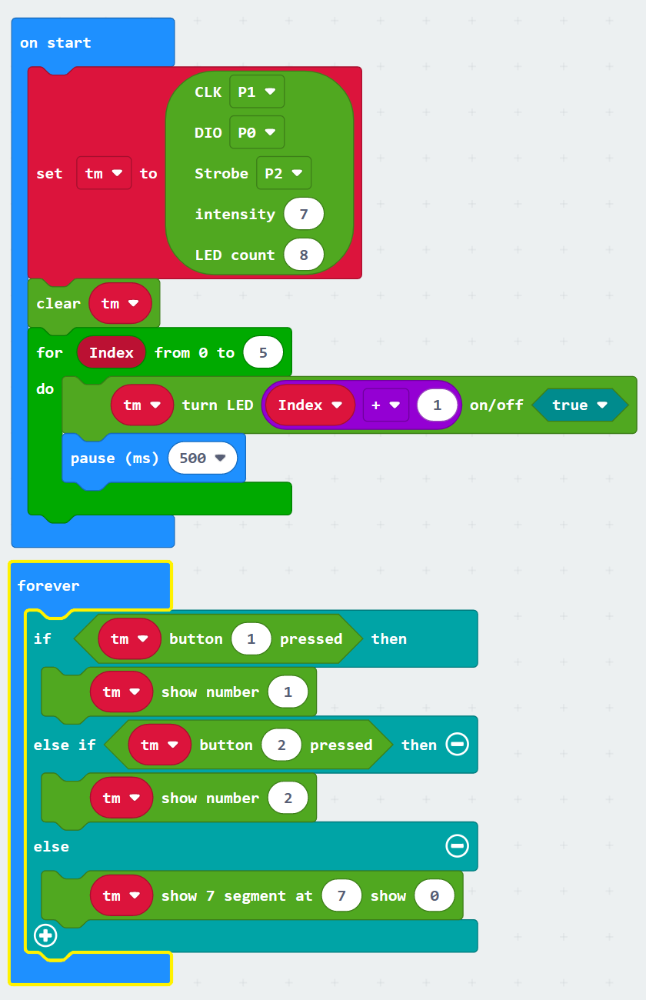

# LED & Keys (TM1638)
makecode LED & Keys (TM1638) Package for microbit  

Author: azplanlos

Based on https://github.com/makecode-extensions/TM1637 and https://github.com/gavinlyonsrepo/TM1638plus used as template

This is a simple extension to use a LED & Keys module based on a TM1638 IC with micro:bit using MakeCode blocks. Please be aware that most LED & Keys modules need to work with 5V logic levels and power. Our module could use th 7-Segment display and LED output with micro:bit's 3.3V but reading the power buttons only worked with a logic level shift. This might be different with other modules.

This is how to hook up the level shifter with a micro:bit, 5V power needs to be provided externally using a USB port for example.

## API

- **create(clk: DigitalPin, dio: DigitalPin, strobe: DigitalPin, intensity: number, count: number)**  
  create a TM1638 object.
    - clk, any DigitalPin
    - dio, any DigitalPin
    - strobe, any DigitalPin
    - intensity, set display brightness, range [0-8]
    - count, LED count, range [1-8]
    
- **clear()**  
  clear content of the display and LEDs.

- **showNumber(num: number)**  
  show a integer number right aligned in display.

- **setBrightness(intensity: number)**  
  set display intensity, range [0-7].
    
- **showText(text: string)**  
  output text on 7 segment display using basic font

- **show7Segment(position: number, value: number)**  
  output character on 7 segment display

- **setLed(ledNum: number, on: boolean)**  
  switch LED on or off, range of LED numbers as printed on the board [1-8]

- **readButtons(): number**  
  read the state of all buttons as binary value. Button 1 equals 1, Button 2 equals 2, Button 8 equals 128, etc. Multiple pressed buttons can be detected.

- **buttonPressed(buttonNum: number): boolean**  
  read state of a single button, number as printed on the board in range [1-8]

## Demo

## License

MIT

## Supported targets

* for PXT/microbit
